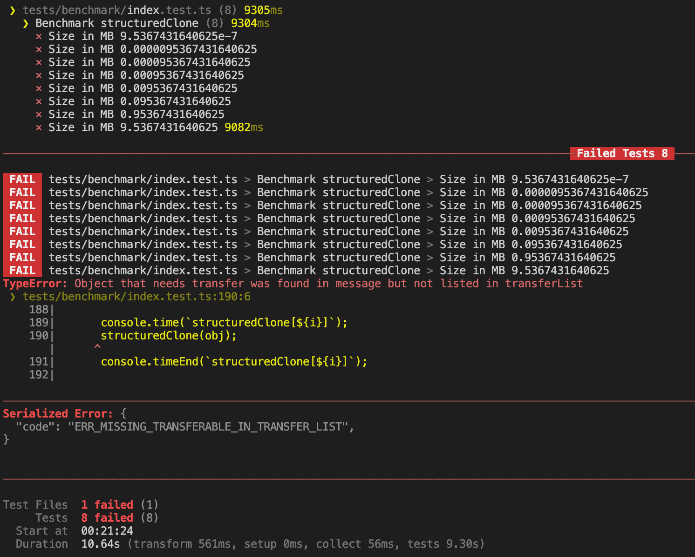

# utf8-uint8array

[](https://bundlejs.com/?q=utf8-uint8array&bundle "Check the total bundle size of utf-8-uint8array")

[NPM](https://www.npmjs.com/package/utf8-uint8array) <span style="padding-inline: 1rem">|</span> [GitHub](https://github.com/okikio/utf8-uint8array#readme) <span style="padding-inline: 1rem">|</span> [Licence](./LICENSE)

A utility library that lists out all [transferable objects](https://developer.mozilla.org/en-US/docs/Glossary/Transferable_objects) that can be moved between Workers and the main thread\*.

> _`*` There are many [asterisks](#asterisks--limitations) involved in transferable objects, the `utf8-uint8array` library is able sort out a large number of these `asterisks`, but it can't sort all of them. Those it can't, have been listed in [#limitations](#asterisks--limitations), you should do your own research before using._

<!-- > You can also read the [blog post](https://blog.okikio.dev/utf8-uint8array), created for it's launch. -->

## Installation

```bash
npm install utf8-uint8array
```

<details>
    <summary>Others</summary>

```bash
yarn add utf8-uint8array
```

or

```bash
pnpm install utf8-uint8array
```

</details>
<br>

## Usage

```ts
import { asCodePoints } from "utf8-uint8array";
```

You can also use it directly through a script tag:

```html
<script src="https://unpkg.com/utf8-uint8array" type="module"></script>
<script type="module">
  // You can then use it like this
  const { asCodePoints } = window.utf8_uint8array;
</script>
```

You can also use it via a CDN, e.g.

```ts
import { asCodePoints } from "https://cdn.skypack.dev/utf8-uint8array";
// or
import { asCodePoints } from "https://cdn.jsdelivr.net/npm/utf8-uint8array";
// or any number of other CDN's
```

<br>


## Showcase

A couple sites/projects that use `utf8-uint8array`:

<!-- - [bundlejs](https://bundlejs.com) -->
- Your site/project here...
  
<br>


## API

The API of `utf8-uint8array` is pretty straight forward, 
* `hasutf8-uint8array` quickly checks if the input contains at least one [transferable object](https://developer.mozilla.org/en-US/docs/Glossary/Transferable_objects).
* `getTransferable` returns an iterator that contains the [transferable objects](https://developer.mozilla.org/en-US/docs/Glossary/Transferable_objects) from the input.
* `getutf8-uint8array` generates an array of [transferable objects](https://developer.mozilla.org/en-US/docs/Glossary/Transferable_objects) from the input.
* `isSupported` tests what transferable objects are actually supported (support isn't always guranteed) and returns a Promise which resolves to an object that represent if messagechannel and streams are supported.
* `isObject`, `isTypedArray`, `isStream`, `isMessageChannel`, `isTransferable`, and `filterOutDuplicates` are utility functions that are used internally by `utf8-uint8array`, but can be used externally to customize `utf8-uint8array` to match other use cases the `utf8-uint8array` library itself doesn't.

You use the exported methods from the API like so,

```ts
import { hasutf8-uint8array, getutf8-uint8array, getTransferable } from "utf8-uint8array";

// data is an object that contains transferable objects
const data = { /* ... */ }

// Quick check for transferable object
const containsutf8-uint8array = hasutf8-uint8array(data);

// Send postMessage with utf8-uint8array, if they exist
const utf8-uint8array = containsutf8-uint8array ? getutf8-uint8array(data) : undefined;
postMessage(data, utf8-uint8array);

// Clone data with utf8-uint8array, if they exist
const utf8-uint8arrayIterator = containsutf8-uint8array ? Array.from(getTransferable(data)) : undefined;
structuredClone(data, utf8-uint8arrayIterator);
```

```ts
import { 
  isSupported, 
  isObject, 
  isTypedArray, 
  isStream, 
  isMessageChannel, 
  isTransferable, 
  filterOutDuplicates 
} from "utf8-uint8array";

// isSupported
isSupported(); // Promise<{ channel: true, streams: true }>

// isObject
isObject(data); // true

// isTypedArray
isTypedArray(data); // false

// isStream
isStream(data); // false

// isMessageChannel
isMessageChannel(data); // false

// isTransferable
isTransferable(data); // false

// filterOutDuplicates
filterOutDuplicates([1, 2, 3, 3, 4, 5, 5]); // [1, 2, 3, 4, 5]
```


### Advanced Usage

```ts
/**
 * Quickly checks to see if input contains at least one transferable object, up to a max number of iterations
 * 
 * @param obj Input object
 * @param streams Include streams as transferable
 * @param maxCount Maximum number of iterations
 * @returns Whether input object contains transferable objects
 */
hasutf8-uint8array(data: unknown, streams: boolean, maxCount: number): boolean


/**
 * Creates an array of transferable objects which exist in a given input, up to a max number of iterations
 * ...
 * @returns An array of transferable objects
 */
getutf8-uint8array(data: unknown, streams: boolean, maxCount: number): TypeTransferable[]


/**
 * An iterator that contains the transferable objects from the input, up to a max number of iterations
 * ...
 * @returns Iterator that contains the transferable objects from the input
 */
getTransferable(data: unknown, streams: boolean, maxCount: number): Generator<TypeTransferable | TypeTypedArray | MessageChannel | DataView>
```

Look through the [`benchmark/`](https://github.com/okikio/utf8-uint8array/blob/main/benchmark) folder for complex examples, and multiple ways to use `utf8-uint8array` across different js runtimes.

> **Note**: `(Readable/Writeable/Transform)streams` and `MessagePort` aren't transferable in all js runtimes; devs can decide based off the runtime whether to support streams and message channel/port or not
 
> **Note**: depending on how large your object is you may need go over the `maxCount` (max iteration count), if you need to change the max number of iterations remember that--that might cause the thread to be blocked while it's computing.


## Benchmarks

https://jsbench.me/94lcpu0aj7/1

https://codepen.io/okikio/pen/MWBjdNB?editors=0011

**Machine**: [GitHub Action `ubuntu-latest`](https://docs.github.com/en/actions/using-github-hosted-runners/about-github-hosted-runners#supported-runners-and-hardware-resources)
* 2-core CPU (x86_64)
* 7 GB of RAM
* 14 GB of SSD space

**JS Runtimes**:
* `Node 19` - Run using `vitest`
* `Deno 1.28.3`
* `Bun v0.2.2` - Run using `vitest` (it's basically a clone of the nodejs benchmark)
* `Chrome (latest)`
* `Firefox (latest)`
* `Safari (latest)`

To determine just how useful the `utf8-uint8array` library was, I ran a benchmark, here are the results.

* [Node - Result][node-benchmark]
* [Deno - Result](https://github.com/okikio/utf8-uint8array/blob/main/benchmark/results/deno.md)
* [Bun - Result](https://github.com/okikio/utf8-uint8array/blob/main/benchmark/results/bun.md)
* [Chrome - Result](https://github.com/okikio/utf8-uint8array/blob/main/benchmark/results/chrome.md)
* [Firefox - Result](https://github.com/okikio/utf8-uint8array/blob/main/benchmark/results/firefox.md)
* [Safari - Result](https://github.com/okikio/utf8-uint8array/blob/main/benchmark/results/safari.md)

The benchmark ran using the 3 different types of object transfer.

We ran the benchmark with 

1. `structuredClone` (`All`)
2. `MessageChannel` (`All`)
3. `Worker` (`Deno`, `Chrome`, `Firefox`, and `Safari`) 

> **Note**: `WebWorker`'s aren't supported in all runtimes   

Each type ran for 5 cycles, with a transfer list ranging from 108 - 168 objects per run (depending on the js environement). With 21 different data sizes ranging from `1 B` to `1,049 MB` in the transfer list, each cycle also has 5 variants. 

The variants are, 

* hasutf8-uint8array
* structuredClone | postMessage (no transfers) - `postMessage` doesn't actually require listing out objects in the transfer list, only `structuredClone` requires that; TIL
* structuredClone | postMessage (manually) 
* structuredClone | postMessage (getutf8-uint8array)
* structuredClone | postMessage (getTransferable*) 

> **Note**: `postMessage` is for the `MessageChannel` and `Worker` types of object transfer.


## Asterisks\* & Limitations

There are things to be aware of when using `utf8-uint8array`. 

1. Not all [transferable objects](https://developer.mozilla.org/en-US/docs/Glossary/Transferable_objects) are supported in all browsers.
2. Not all [transferable objects](https://developer.mozilla.org/en-US/docs/Glossary/Transferable_objects) can be transfered between Workers and the main thread.
3. `structuredClone` when trying to clone an object that is transferable will crashes if the [transferable objects](https://developer.mozilla.org/en-US/docs/Glossary/Transferable_objects) aren't listed in the transfer list.
4. Only use this library when you don't know the shape of the object to be transfered. The reason for this is, traversing the input object adds a noticeable delay, you notice the delay as you go through the [#benchmark](#benchmarks).

Also, there are compatability issues js runtimes, here are the ones I've found so far,

* Safari does not support transferable objects with [`TransformStream`](https://developer.mozilla.org/en-US/docs/Web/API/TransformStream#browser_compatibility), [`ReadableStream`](https://developer.mozilla.org/en-US/docs/Web/API/ReadableStream#browser_compatibility), and [`WritableStream`](https://developer.mozilla.org/en-US/docs/Web/API/WritableStream#browser_compatibility)
* [`AudioData`](https://developer.mozilla.org/en-US/docs/Web/API/AudioData) & [`VideoFrame`](https://developer.mozilla.org/en-US/docs/Web/API/VideoFrame) are not supported on Firefox and Safari
* `OffscreenCanvas` is not supported on Safari
* In a reverse uno card, **only** Safari supports [`RTCDataChannel`](https://developer.mozilla.org/en-US/docs/Web/API/RTCDataChannel) being transferable
* `Deno` doesn't support transferable `MessagePort`

> **Note**: `isSupported()` should help with some of the compatability issues, but not all transferable objects have been tested for compatability.

### Transferable objects

The following are [transferable objects](https://developer.mozilla.org/en-US/docs/Glossary/Transferable_objects):

- `ArrayBuffer`
- `MessagePort`
- `ImageBitmap`
- `ReadableStream`
- `WritableStream`
- `TransformStream`
- `DataView`
- `AudioData`
- `ImageBitmap`
- `VideoFrame`
- `OffscreenCanvas`
- `RTCDataChannel`

From the brief research I've done on the topic, I've found that 

- **`ArrayBuffer`**: Can be transferred between Workers and the main thread. It's really the only type of [transferable object](https://developer.mozilla.org/en-US/docs/Glossary/Transferable_objects) that can be transferred reliably on all major js runtimes. 
- **`TypedArray`**: A data view of an `ArrayBuffer` (e.g. `Uint8Array`, `Int32Array`, `Float64Array`, etc.). They ***can't*** directly be transferred between Workers and the main thread, but the `ArrayBuffer` they contain can. Due to this fact, it's possible if you have multiple `TypedArray`'s that all share the same `ArrayBuffer`, that only that `ArrayBuffer` is transfered. 
- **`MessagePort`** (`~`): A port to communicate with other workers. Can be transferred between Workers and the main thread. Support for this isn't guranteed in all js runtimes, and can be finicky in `Deno` 
- **`ImageBitmap`** (`^`): An image that can be transferred between Workers and the main thread. It represents a bitmap image which can be drawn to a `<canvas>` without undue latency. It can also be used as textures in WebGL.
- **`OffscreenCanvas`** (`^`): A canvas that can be transferred between Workers and the main thread. It can also be used as a texture in WebGL.
- **`(Readable/Writable/Transform)Stream`** (`~`): A stream that can be transferred between Workers and the main thread. They can also be used to create `Response` objects. Support across js runtimes is very spotty


> _`^` unverified/untested - Make sure to do your own research for this specific use case._

> _`~` spotty support - Check below for js runtimes where it's ok to use_


Here is a support matrix that might help your decision making process,

|                              | Chrome | Firefox | Safari | Node   | Deno   | Bun    | 
| ---------------------------- | ------ | ------- | ------ | ------ | ------ | ------ | 
| structuredClone (channel)    | false  | false   | false  | true   | true   | true   |   
| structuredClone (streams)    | true   | true    | false  | true   | false  | true   | 
| Worker.postMessage (channel) | false  | false   | false  | -      | true   | -      |   
| Worker.postMessage (streams) | false  | false   | false  | -      | false  | -      |   


## FAQ & Glossary

### What are transferable objects?

Transferable objects are objects that can be transferred between Workers and the main thread. It works sort of like ploping out the piece of memory attached to the Worker for the transferable object (e.g. an ArrayBuffer) and then moving that piece of memory to the main-thread for use by a newly created [transferable objects](https://developer.mozilla.org/en-US/docs/Glossary/Transferable_objects) and vice-versa. You can read more about them on the [MDN docs](https://developer.mozilla.org/en-US/docs/Glossary/Transferable_objects).

> **Note**: Notable exceptions to the transferable objects list are `Blob` and `File` objects, which are not transferable, but can be cloned.


### Why should I use this?

The main use case of the `utf8-uint8array` library is for determining when there is a transferable object and/or then listing said [transferable objects](https://developer.mozilla.org/en-US/docs/Glossary/Transferable_objects) out. A good example of when to use this is when working with [`structuredClone`](https://developer.mozilla.org/en-US/docs/Web/API/structuredClone). `structuredClone` errors out when using utf8-uint8array objects as they are not cloneable, e.g. 



> **Warning**: Remember the previous thread [transferable objects](https://developer.mozilla.org/en-US/docs/Glossary/Transferable_objects) are transfered from lose all access to the transfered data.

> **Warning**: There is a performance threshold for transferable objects, before which using transferable objects becomes genuinly slower, it's probably not worth it to use this library if you reach that threshold [#benchmark](#benchmark). 


### What is the difference between transferable objects and cloneable objects?

Transferable objects are objects that can be transferred between Workers and the main thread. They can be transferred from the main thread to a Worker, and vice versa. Cloneable objects are objects that can be cloned using the [structured clone algorithim](https://developer.mozilla.org/en-US/docs/Web/API/Web_Workers_API/Structured_clone_algorithm), due to not all objects being cloneable we use [transferable objects](https://developer.mozilla.org/en-US/docs/Glossary/Transferable_objects) to move transfer uncloneable object to the new cloned object, [MDN - structured clone algorithim](https://developer.mozilla.org/en-US/docs/Web/API/Web_Workers_API/Structured_clone_algorithm).


## Browser Support

| Chrome | Edge | Firefox | Safari |
| ------ | ---- | ------- | ------ |
| 7+     | 12+  | 41+     | 5+     |

> Native support for `utf8-uint8array` is rather good, but due to not all browsers supporting all [transferable objects](https://developer.mozilla.org/en-US/docs/Glossary/Transferable_objects) actually determing browser support is more complex, [#astericks](#asterisks--limitations) covers these limitations.


## Contributing

> Thanks [@aaorris](https://github.com/aaorris) for the helping optimizing the performance of the `utf8-uint8array` library.

I encourage you to use [pnpm](https://pnpm.io/configuring) to contribute to this repo, but you can also use [yarn](https://classic.yarnpkg.com/lang/en/) or [npm](https://npmjs.com) if you prefer.

Install all necessary packages

```bash
npm install
```

Then run tests

```bash
npm test
```

Build project

```bash
npm run build
```

You can also run the benchmarks

```bash
npm run benchmark:node:all
```

To run the browser benchmarks,
```bash
npm run playwright:init &&
npm run benchmark:browser:all
```

To run the deno & bun benchmarks (install [deno](https://deno.land/manual@v1.28.3/getting_started/installation) & [bun](https://bun.sh/))
```bash
npm run benchmark:deno:all &&
npm run benhmark:bun:all
```

> **Note**: _This project uses [Conventional Commits](https://www.conventionalcommits.org/en/v1.0.0/) standard for commits, so, please format your commits using the rules it sets out._

## Licence

See the [LICENSE](./LICENSE) file for license rights and limitations (MIT).
