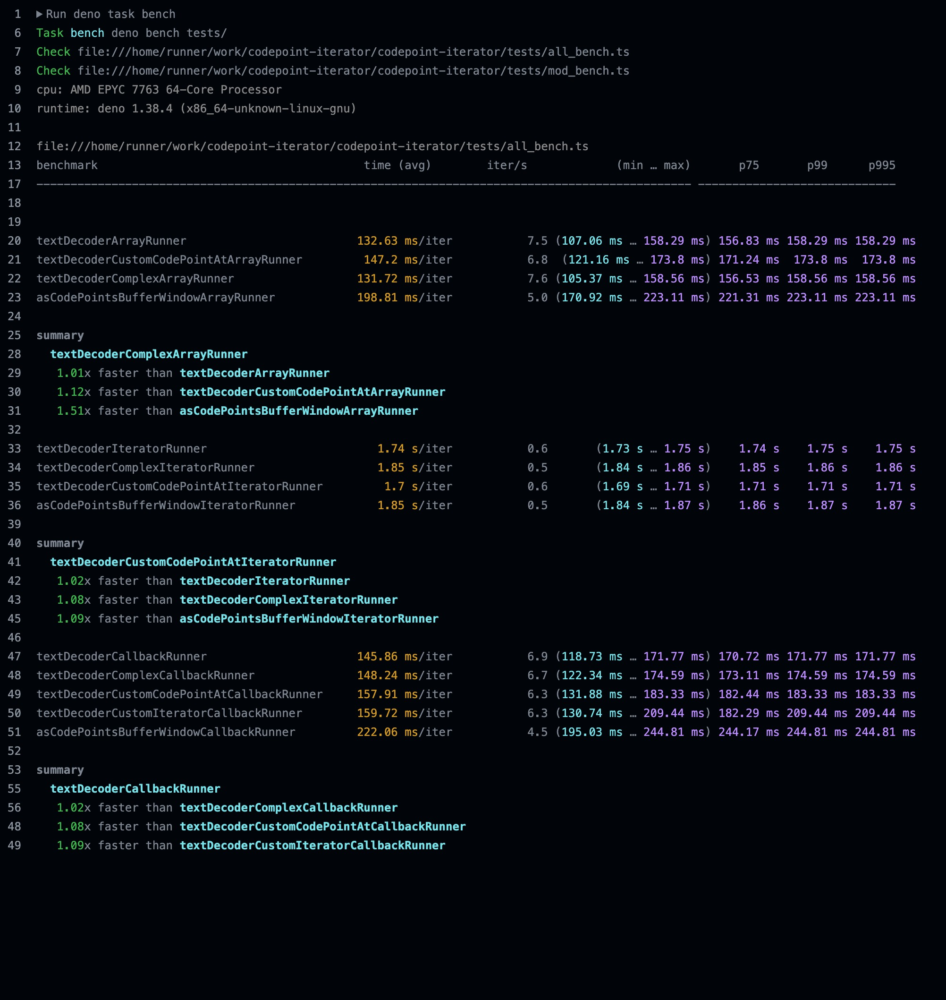

# codepoint-iterator

[](https://bundlejs.com/?q=codepoint-iterator&bundle "Check the total bundle size of utf-8-uint8array")

[NPM](https://www.npmjs.com/package/codepoint-iterator) <span style="padding-inline: 1rem">|</span> [GitHub](https://github.com/okikio/codepoint-iterator#readme) <span style="padding-inline: 1rem">|</span> [Licence](./LICENSE)

<!-- Bundle size badge (unavailable) -->
<!-- [](https://bundlejs.com/?q=codepoint-iterator) -->

`codepoint-iterator` is a utility library that provides functions for converting an iterable of UTF-8 filled Uint8Array's into Unicode code points. The library supports both synchronous and asynchronous iterables and offers different ways to produce code points, including as an async generator, as an array, or by invoking a callback for each code point.

## Installation

### Node

```bash
npm install codepoint-iterator
```

<details>
    <summary>Others</summary>

```bash
yarn add codepoint-iterator
```

or

```bash
pnpm install codepoint-iterator
```

</details>

```ts
import { asCodePointsIterator, asCodePointsArray, asCodePointsCallback } from "codepoint-iterator";
```

### Deno

```ts
import { asCodePointsIterator, asCodePointsArray, asCodePointsCallback } from "https://deno.land/x/codepoint_iterator/mod.ts";
```

### Web

```html
<script src="https://unpkg.com/codepoint-iterator" type="module"></script>
```

You can also use it via a CDN, e.g.

```ts
import { asCodePointsIterator } from "https://esm.run/codepoint-iterator";
// or
import { asCodePointsIterator } from "https://esm.sh/codepoint-iterator";
// or
import { asCodePointsIterator } from "https://unpkg.com/codepoint-iterator";
// or
import { asCodePointsIterator } from "https://cdn.skypack.dev/codepoint-iterator";
// or
import { asCodePointsIterator } from "https://deno.bundlejs.com/file?q=codepoint-iterator";
// or any number of other CDN's
```

## API

### `asCodePointsIterator(iterable)`

Converts an iterable of UTF-8 filled Uint8Array's into an async generator of Unicode code points.

### `asCodePointsArray(iterable)`

Converts an iterable of UTF-8 filled Uint8Array's into an array of Unicode code points.

### `asCodePointsCallback(iterable, cb)`

Processes an iterable of UTF-8 filled Uint8Array's and invokes a callback for each code point.

## Examples

Check out the [examples/](./examples/) folder on GitHub.

### Using `asCodePointsIterator` with an async iterable tokenizer

```ts
import { asCodePointsIterator } from "codepoint-iterator";
// or 
// import { asCodePointsIterator } from "https://deno.land/x/codepoint_iterator/mod.ts";

async function* tokenizer(input) {
  // Simulate an async iterable that yields chunks of UTF-8 bytes
  for (const chunk of input) {
    yield new TextEncoder().encode(chunk);
  }
}

(async () => {
  const input = ["Hello", " ", "World!"];
  for await (const codePoint of asCodePointsIterator(tokenizer(input))) {
    console.log(String.fromCodePoint(codePoint));
  }
})();
```

### Using `asCodePointsArray` with ChatGPT or another AI workload

```ts
import { asCodePointsArray } from "codepoint-iterator";
// or 
// import { asCodePointsArray } from "https://deno.land/x/codepoint_iterator/mod.ts";

// Simulate an AI workload that returns a response as an array of Uint8Array chunks
async function getAIResponse() {
  return [new TextEncoder().encode("Hello, "), new TextEncoder().encode("I am an AI.")];
}

(async () => {
  const responseChunks = await getAIResponse();
  const codePoints = await asCodePointsArray(responseChunks);
  const responseText = String.fromCodePoint(...codePoints);
  console.log(responseText);
})();
```

### Using `asCodePointsCallback` for a CSS tokenizer

```ts
import { asCodePointsCallback } from "codepoint-iterator";
// or 
// import { asCodePointsCallback } from "https://deno.land/x/codepoint_iterator/mod.ts";

async function tokenizeCSS(css: string) {
  const tokens: string[] = [];
  let currentToken = "";

  // Create an array containing the Uint8Array object
  const cssChunks = [new TextEncoder().encode(css)];

  await asCodePointsCallback(cssChunks, (codePoint: number) => {
    const char = String.fromCodePoint(codePoint);
    if (char === '{' || char === '}') {
      if (currentToken) {
        tokens.push(currentToken.trim());
        currentToken = "";
      }
      tokens.push(char);
    } else {
      currentToken += char;
    }
  });

  return tokens;
}

const css = `
  body {
    background-color: white;
    color: black;
  }

  h1 {
    font-size: 24px;
  }
`;

const tokens: string[] = await tokenizeCSS(css);
console.log(tokens);
// Output: [ 'body', '{', 'background-color: white;', 'color: black;', '}', 'h1', '{', 'font-size: 24px;', '}' ]
```

## Usage with Async Iterables
The functions in `codepoint-iterator` support both synchronous and asynchronous iterables. This means you can use them with data sources that produce chunks of bytes asynchronously, such as file streams, network streams, or other async generators.

Here's an example of using `asCodePointsIterator` with an async iterable that reads chunks from a file:

### Node

```ts
import { asCodePointsIterator } from "codepoint-iterator";
// or 
// import { asCodePointsIterator } from "https://deno.land/x/codepoint_iterator/mod.ts";
import { createReadStream } from "node:fs";

const fileStream = createReadStream("example.txt");

(async () => {
  for await (const codePoint of asCodePointsIterator(fileStream)) {
    console.log(String.fromCodePoint(codePoint));
  }
})();
```

In this example, we use the `createReadStream` function from the `fs` module to create a readable stream for a file. We then pass the stream to `asCodePointsIterator`, which processes the chunks of bytes and yields the corresponding Unicode code points.

### Deno

```ts
import { asCodePointsIterator, getIterableStream } from "https://deno.land/x/codepoint_iterator/mod.ts";

(async () => {
  const file = await Deno.open("example.txt", { read: true })

  for await (const codePoint of asCodePointsIterator(getIterableStream(file.readable))) {
    console.log(String.fromCodePoint(codePoint));
  }
})();
```

In this example, we are using the `asCodePointsIterator` function from the `codepoint-iterator` library to read the contents of a file named `example.txt` and print each Unicode code point as a character. The `getIterableStream` function is used to convert a Deno readable stream into an iterable of `Uint8Array` chunks.

## Showcase

A couple sites/projects that use `codepoint-iterator`:
- Your site/project here...
  

## Benchmarks

The `asCodePointsIterator`, `asCodePointsArray`, and `asCodePointsCallback` functions been thorougly tested to make sure they are the most performant variants for iterators, arrays, and callbacks possible. You can check the latest benchmark results in the GitHub Actions page.

**Machine**: [GitHub Action `ubuntu-latest`](https://docs.github.com/en/actions/using-github-hosted-runners/about-github-hosted-runners#supported-runners-and-hardware-resources)

As of `Friday May 5, 2023` on `Deno v1.33.2` here are the results:




## Conclusion
`codepoint-iterator` is a versatile library that makes it easy to work with Unicode code points in JavaScript and TypeScript. Whether you're tokenizing text, processing AI responses, or working with file streams, `codepoint-iterator` provides a simple and efficient way to handle UTF-8 encoded data. Give it a try and see how it can simplify your code!


## Contributing

> Thanks [@jonathantneal](https://github.com/jonathantneal) for the assistance with developing the `codepoint-iterator` library.

This package is written [Deno](https://deno.land) first, so you will have to install Deno.

Run tests

```bash
deno task test
```

Run benchmarks

```bash
deno task bench
```

Build package

```bash
deno task build
```

> **Note**: _This project uses [Conventional Commits](https://www.conventionalcommits.org/en/v1.0.0/) standard for commits, so, please format your commits using the rules it sets out._

## Licence

See the [LICENSE](./LICENSE) file for license rights and limitations (MIT).
